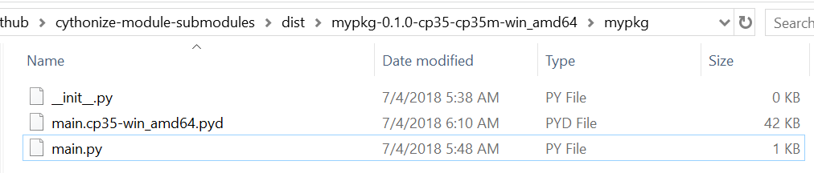

# Research process to achieve successful compilation and packaging

## Step 1 - Commit 8180d914c8a211ce051104b78114af542e81b5f3

Fails with the following message:

```
LINK : error LNK2001: unresolved external symbol PyInit___init__
build\temp.win-amd64-3.5\Release\build\mypkg\__init__.cp35-win_amd64.lib : fatal error LNK1120: 1 unresolved externals
```

Apparently, that's because I am trying to compile `__init__.py` files.

NEXT : Modifying the setup_all to remove them.

## Step 2 - Commit 3d0da8c2eb9e23b95e49e8a40e1aed3e78c3c433

By using the `glob` package, and removing the `__init__.py` files from the build process, a wheel archive could be successfully generated.

However, two surprising things:

  - Running `python test.py` after installing the wheel works, although only `mypkg.main` ended up in the list of files to compile
  - Inside the wheel file, there are only three files:



Yet, here is what happens when running `python test.py`:

```
$ python test.py
mypkg_fn called
mysubpkg1_fn called
mysubpkg2_fn called
```

Each module is properly called. It looks like the submodules were properly compiled. WEIRD.

NEXT : Modifying package code to determine if running from python or compiled sources

## Step 3 - Bitten in the butt by python import system - Commit d8aaf5fcd5825a73139ab689402c12f502c7623c

Printing `__file__` inside each python source file revealed that calling `test.py` was simply calling the original python sources, not the binary wheel-installed version of the program. Silly error.

```
mypkg_fn called. Value of __file__: C:\Users\remib\Github\cythonize-module-submodules\mypkg\main.py
mysubpkg1_fn called. Value of __file__: C:\Users\remib\Github\cythonize-module-submodules\mypkg\mysubpkg1\main.py
mysubpkg2_fn called. Value of __file__: C:\Users\remib\Github\cythonize-module-submodules\mypkg\mysubpkg2\main.py
```

Basically, the `test.py` file located at the root of the directory could load the python sources since mypkg was simply located in the same directory. Moving the `test.py` file to a `./test` folder prevented this.

Now, I do get a more interesting error running the python test file:

```
$ python test/test.py
Traceback (most recent call last):
  File "test/test.py", line 1, in <module>
    from mypkg.main import mypkg_fn
  File "mypkg\main.py", line 1, in init mypkg.main
    from mypkg.mysubpkg1.main import *
ImportError: No module named 'mypkg.mysubpkg1'
```

Turns out the subpackages cannot be imported, which makes sense because obviously they are not copied inside the wheel file (see screen above).

NEXT: Back to the `setup_all.py` file to try to include subpackages

# Step 4 - Compile all the things - Commit 29ae47ad9ab973c557b89d7e094a10eca2dd6668

In this step, I just fixed the scan_sources function to detect all python files recursively, not just the ones located at top directory.

The generated wheel file is much more like I expected:


It contains the submodules folders, each containing a .pyd file (cythonized python file).
There is an `__init__.py` at top level, meaning top level module can be importable.

There is still a couple of things not right:

1. No `__init__.py` inside submodules, meaning that mypkg.mysubpkg1 for instance should not be importable
2. `main.py` file at root directory containing raw python sources

However, to my great surprise, this packaged version can run successfully !

```
$ python test/test.py
('mypkg_fn called. Value of __file__:', 'C:\\Users\\remib\\Miniconda3\\envs\\cython\\lib\\site-packages\\mypkg\\main.cp35-win_amd64.pyd')
('mysubpkg1_fn called. Value of __file__:', 'C:\\Users\\remib\\Miniconda3\\envs\\cython\\lib\\site-packages\\mypkg\\mysubpkg1\\main.cp35-win_amd64.pyd')
('mysubpkg2_fn called. Value of __file__:', 'C:\\Users\\remib\\Miniconda3\\envs\\cython\\lib\\site-packages\\mypkg\\mysubpkg2\\main.cp35-win_amd64.pyd')
```

Turns out I was wrong regarding 1. In Python 3.3+, it is no longer required to have an `__init__.py` file, therefore the submodules are importables.
We can see from the logs that the code is running from a cythonized file (.pyd), even the main file that is available inside the wheel file both as a .py and .pyd file.

Because our goal is to make reverse-engineering harder, let's try to remove the .py file from the wheel that seems is not even used by python.

NEXT: Back to setup_all.py to find a way to remove main.py file !
